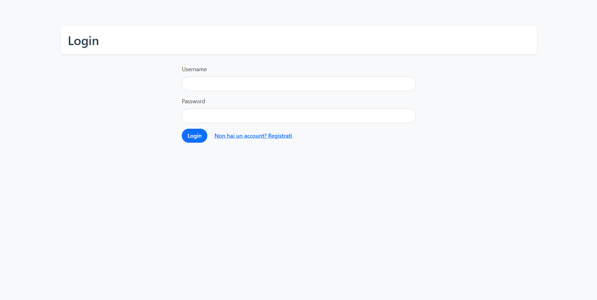
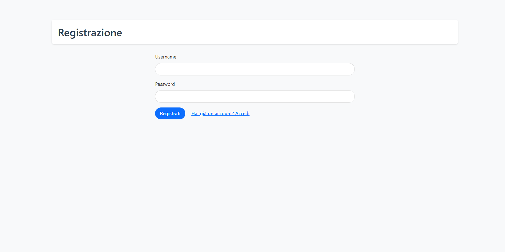
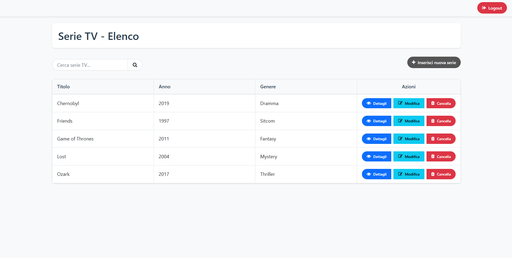
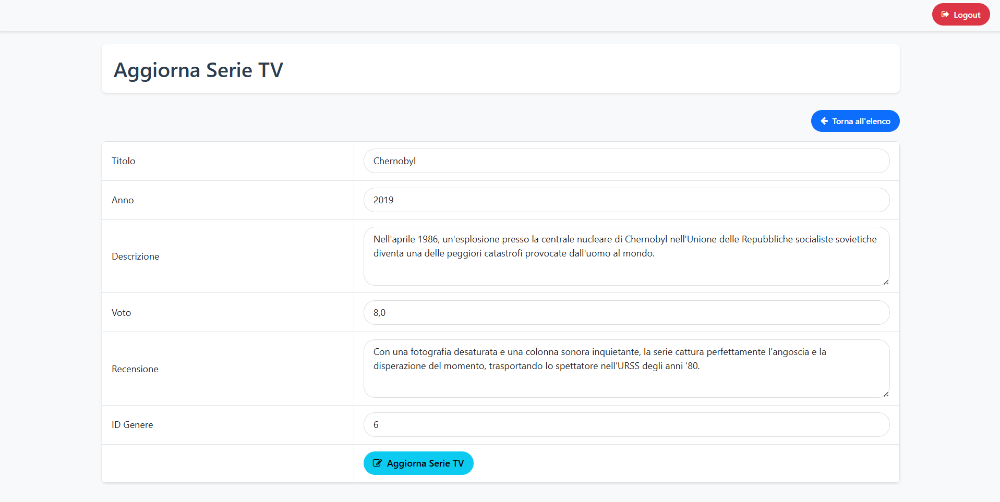
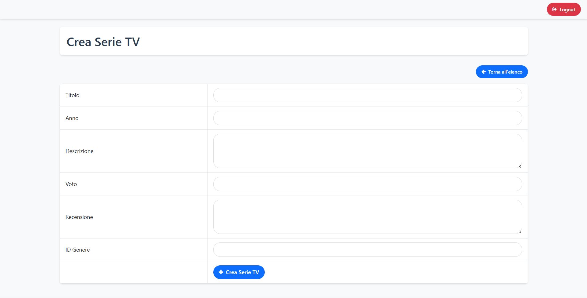
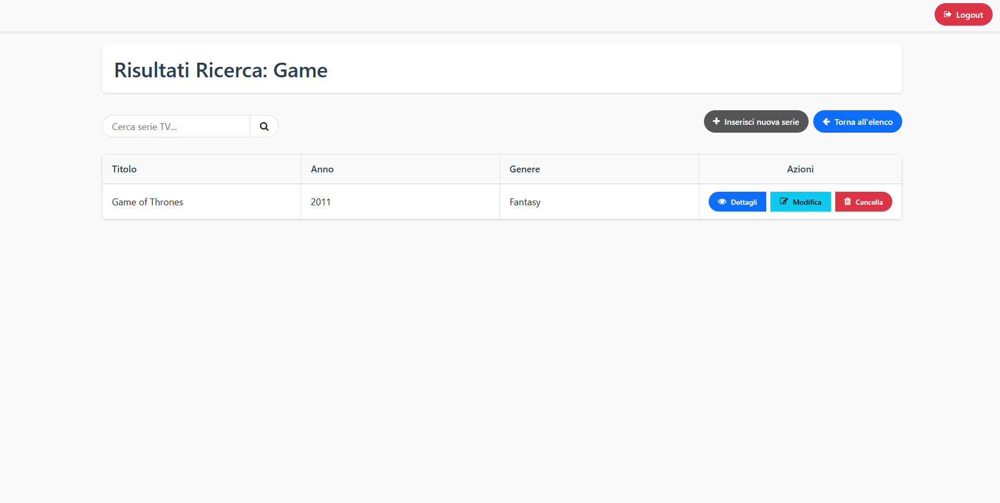
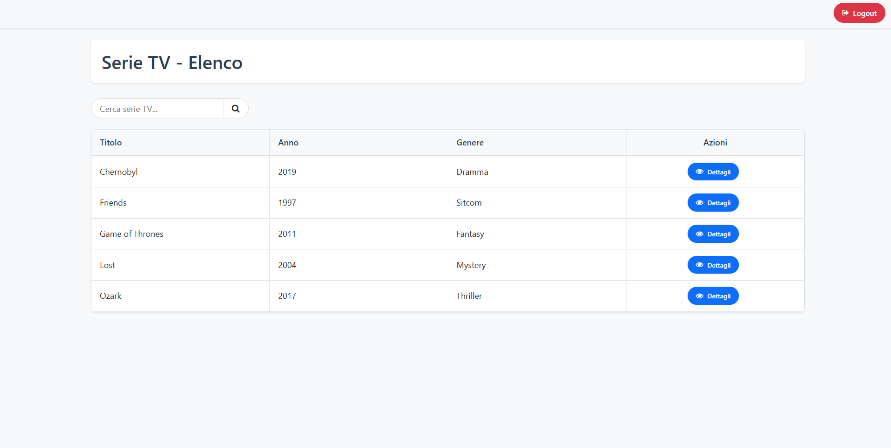

# Progetto Serie TV

Applicazione web per la gestione di serie TV, realizzata per un esame universitario. Comprende un backend PHP (REST API) e un frontend HTML/JS.

---

## Screenshot

Di seguito alcuni screenshot dell'applicazione:









---

## Funzionalità
- Registrazione e login utenti: consente agli utenti di creare un nuovo account e accedere tramite autenticazione. Il sistema gestisce la sessione utente e distingue tra utenti normali e amministratori.
- Visualizzazione, ricerca, creazione, modifica e cancellazione di serie TV: permette agli utenti autenticati di visualizzare l’elenco delle serie TV, cercare per parole chiave e vedere i dettagli di ciascuna serie. Gli amministratori possono inoltre aggiungere nuove serie, modificarle o eliminarle.
- Gestione sessioni utente (utente e amministratore): il sistema mantiene lo stato di login tramite sessioni, consentendo di verificare il tipo di utente collegato e abilitando funzionalità diverse in base ai permessi (utente semplice o amministratore).

---

## Tecnologie utilizzate

- **Frontend:**
	- HTML5
	- CSS3 (con Bootstrap 5)
	- JavaScript (ES6)
	- jQuery
		- AJAX
		- bootbox.js
		- Font Awesome (icone)

- **Backend:**
	- PHP (>= 7.4)
	- Programmazione ad oggetti (OOP)
	- REST API

- **Database:**
	- MySQL/MariaDB

- **Strumenti e ambiente di sviluppo:**
	- XAMPP (o MAMP/WAMP)
	- phpMyAdmin
	- Visual Studio Code
	- Git

---

## Requisiti
- PHP >= 7.4
- MySQL/MariaDB
- Server locale (es. XAMPP, MAMP, WAMP) o server web con supporto PHP
- Browser moderno

---

## Struttura del progetto

```
progetto-serietv/
│
├── backend/
│   ├── api/           # Endpoint REST PHP
│   └── dataMgr/       # Classi PHP e file di esempio/configurazione
│
├── frontend/
│   ├── home.html      # Pagina principale
│   ├── css/           # Stili CSS
│   └── js/            # Script JavaScript
│
├── .gitignore
├── README.md
├── LICENSE
```

---

## Setup rapido

1. Clona la repository
2. Sposta la cartella del progetto all'interno della cartella servita dal tuo server web:
	 - Per XAMPP: `C:/xampp/htdocs/tuacartella`
	 - Per WAMP/MAMP: `www/tuacartella`
	 - Per altri server: nella directory configurata come DocumentRoot
3. Importa il database da `backend/dataMgr/serietv.example.sql`
4. Crea il file `backend/dataMgr/Database.php` copiando `Database.example.php` e inserisci le tue credenziali reali di accesso al database (host, nome database, username, password). Il file `Database.php` non è incluso nel repository per motivi di sicurezza.
5. Avvia un server locale (es. XAMPP) e accedi a `frontend/home.html` tramite browser (es. `http://localhost/tuacartella/frontend/home.html`)
6. Modifica la variabile `BASEURL` in `frontend/js/general.js` in base al tuo ambiente (vedi sotto)

---

## Configurazione

### Backend
- **Database:** crea il file `backend/dataMgr/Database.php` a partire da `Database.example.php` e inserisci le tue credenziali personali. Questo file deve contenere i dati reali di connessione.
- **CORS:** di default accetta richieste da qualsiasi origine (solo per sviluppo). In produzione, modifica `backend/api/cors.php` per restringere i domini permessi.

### Frontend
- **BASEURL:** nel file `frontend/js/general.js` imposta la variabile `BASEURL` con l’URL delle API backend, in base al percorso reale della cartella del progetto sul tuo server locale.

	Ad esempio:
	- Se hai copiato la cartella come `C:/xampp/htdocs/progetto-serietv`, il BASEURL sarà:
		```js
		const BASEURL = "http://localhost/progetto-serietv/backend/api/";
		```
	- Se la cartella si chiama diversamente (es. `miosito`):
		```js
		const BASEURL = "http://localhost/miosito/backend/api/";
		```
	- Se pubblichi online o cambi cartella, aggiorna BASEURL di conseguenza affinché punti sempre alla cartella `/backend/api/` accessibile dal browser.

### Database
- Per configurare il database è sufficiente importare il file `serietv.example.sql` (ad esempio tramite phpMyAdmin o strumenti simili) per creare la struttura necessaria. Il file non contiene dati reali.
- In seguito sarà possibile popolare le tabelle con i propri record di test.

---

## Documentazione API

Tutte le API restituiscono risposte in formato JSON. Le operazioni di scrittura/modifica/cancellazione richiedono autenticazione e, dove indicato, permessi da amministratore.

### Autenticazione e sessione
- `POST   /api/login.php`           → Login utente
	- Body: `{ "username": string, "password": string }`
	- Risposta: `{ message, ... }` + cookie di sessione
- `POST   /api/registrazione.php`   → Registrazione nuovo utente
	- Body: `{ "username": string, "password": string }`
	- Risposta: `{ message }`
- `POST   /api/logout.php`          → Logout
	- Risposta: `{ message }`
- `GET    /api/sessionInfo.php`     → Info sulla sessione utente
	- Risposta: `{ loggedIn: bool, userType?: string, username?: string }`

### Serie TV
- `GET    /api/readAll.php`         → Elenco di tutte le serie TV (autenticato)
	- Risposta: `{ seriesList: [ { id, titolo, anno, descrizione, voto, recensione, genereNome } ] }`
- `GET    /api/readOne.php?id=ID`   → Dettaglio di una serie TV (autenticato)
	- Risposta: `{ id, titolo, anno, descrizione, voto, recensione, genereNome }`
- `GET    /api/search.php?keywords=PAROLA` → Ricerca serie TV (autenticato)
	- Risposta: `{ seriesList: [...] }`
- `POST   /api/create.php`          → Crea una nuova serie TV (admin)
	- Body: `{ titolo, anno, descrizione, voto, recensione, genere_id }`
	- Risposta: `{ message }`
- `PUT    /api/update.php`          → Modifica una serie TV (admin)
	- Body: `{ id, titolo, anno, descrizione, voto, recensione, genere_id }`
	- Risposta: `{ message }`
- `DELETE /api/delete.php?id=ID`    → Cancella una serie TV (admin)
	- Risposta: `{ message }`

---

## Sicurezza e limiti

**IMPORTANTE: USA QUESTO PROGETTO SOLO IN AMBIENTI DI TEST O IN LOCALE. NON USARLO MAI SU SERVER PUBBLICI O CON DATI REALI.**

- Le password NON sono cifrate: non inserire mai password vere o dati sensibili.
- Non sono implementate protezioni avanzate contro SQL injection, XSS o CSRF: il codice è vulnerabile e non va mai usato in produzione.
- Il CORS è aperto per sviluppo: in produzione dovresti sempre restringere i domini permessi in `cors.php`.
- Non pubblicare mai dati reali, credenziali o informazioni personali.
- Tutti i file sensibili (come Database.php) sono esclusi dal repository tramite `.gitignore`.
- Questo progetto è solo a scopo didattico e serve per esercitarsi o fare test in locale.

---

## Licenza

MIT
